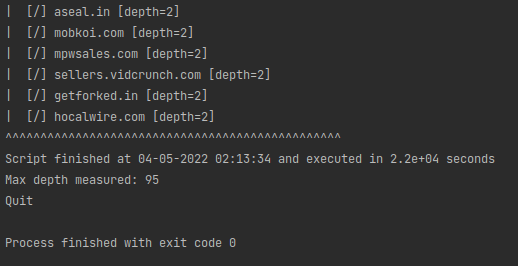

# openxtask2

## Usage
To start script use [main.py](main.py) file. Main.py contains methods used to prepare requests, 
validate response and scan the sellers (nodes of the supply chain).
```bash
python main.py
```

### Parameters
You can change script's behavior in ```main.py``` by specifying four settings

| Setting          | Description                                                                                                        |
|------------------|--------------------------------------------------------------------------------------------------------------------|
| TIMEOUT          | Specify request timeout                                                                                            |
| MAX_REDIRECTIONS | Specify max number of redirections allowed in the root's domain scope                                              |
| INDENT_SIZE      | Specify size of indent. Indent is used to print result in a tree-like format. I recommend to use a value of 2 or 3 |
| VERBOSE          | Print errors occurred while processing request and response                                                        |

### Processing
Supply chain can be very deeply branched, so it can take a long time to scan the entire tree. For example domain ```openx.com```
it took 6h to finish the scan.



> If you exit the program using ```Ctrl+C```, the script still returns the maximum depth measured until the program is terminated.

### Output
Every output line consists of indent part which indicates depth level of the current node in supply chain tree and
the result part. The result part contains suffix which indicates type of output.

| Suffix | Description                                                                                                    |
|--------|----------------------------------------------------------------------------------------------------------------|
| [+]    | Nodes whose ```seller_type``` is set to ```PUBLISHER```. These are **direct sellers**                          |
| [*]    | Confidential publishers. Their names and/or domain names are confidential. There are **direct sellers** either |
| [/]    | Nodes whose ```seller_type``` is set to ```INTERMEDIARY``` or ```BOTH``` who are **indirect sellers**.         |
| [!]    | Invalid nodes. Requirements for valid nodes are described in sellers.json file documentation below.            |

> Indirect seller's line provides depth level of children nodes in the supply chain but **not current node's depth**. 
> 
> For example in line ```[/] google.com [depth=3]``` the depth of 3 describes the depth of the nodes in google's sellers.json file.
> So google.com has depth=2. Given depth is expected value and is compared with max_depth only if sellers.json contains at least
> one child node.

### Documentation
The script is based on the official IAB Tech Lab documentation 
which specifies the way to correctly process the sellers.json file.
 * https://iabtechlab.com/wp-content/uploads/2019/07/Sellers.json_Final.pdf
 * https://iabtechlab.com/wp-content/uploads/2019/07/FAQ-for-sellers.json_supplychain-object.pdf

## Testing

### tests/tests.py
This script allows to test data requesting and response validation. Test cases:
 * domain name retrieved from sellers.json file contains suffix or subdirectory
 * http and https url created on the basis of given domain has proper format
 * indent size grows in proportion to depth
 * request data function returns no error for valid domain name
 * request data function returns error for valid domain name which returns incorrect response
 * invalid response content type
 * no connection with domain
 * json entity is missing required 'sellers' key 
 * request has been redirected to other domain


### Usage
To run tests use [tests.py](tests/tests.py) file.
Navigate to ```.../openxtask1``` directory and use following commands:

```bash
python -m unittest tests/tests.py
```

***
> Script created with Python 3.9

Created by Jakub Sieczka ([Opestv2 GitHub](https://github.com/OPestv2 "OPest Github"))
